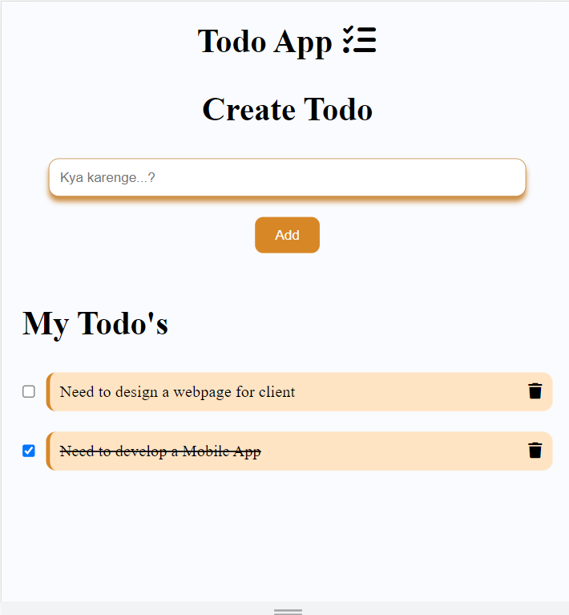

## Todo App

This is Todo App where You can add new todos , delete todos and check it as done also.
 
 The data is storage in localstorage.

 [Livelink](https://resilient-caramel-6731ae.netlify.app/)

 App Image :

 